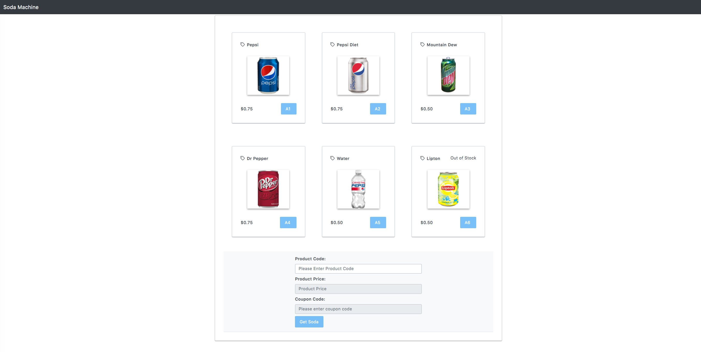

# SodaMachine_AngularJava
This application creates a soda machine that is based on Angular, TypeScript, Java Spring Boot techonologies.


## SodaMachine Angular Client Side
This is the link about how client side is seen https://drive.google.com/file/d/1MLnMFJ0w-sLJcKAkXKo6MNEsO3mruEhR/preview \
<br />
 Here are the steps that you can run the client side of the Soda Machine
1. `npm install`
2. `npm start`



## Soda Machine Java Spring Boot Server Side
This backend structure is based on Java Spring Boot connecting to MySQL database locally with JDBC and querying tables with models.<br/>
<br/>
The backend Java is also using SCHEDULER to send a report email about how many left in inventory.

#### Controller
This part is to get the api request and send them to available services <br/>

Example:<br/>
```
@PutMapping("/api/dispense-product")
	public Product updateProduct(@RequestBody Product dispensedProduct, @RequestParam String couponCode) {
		try {
			Product result = this.productService.updateProductInventory(dispensedProduct.getProductCode());
			if (couponCode != null) {
				this.couponService.updateCoupon(couponCode);
			}
			return result;

		} catch (Exception ex) {
			throw new ResponseStatusException(HttpStatus.NOT_FOUND, "The product is out of inventory", ex);
		}

	}
```

#### Service
This part is to make necessary changes to the data our connection point to repositories <br/>
Example: <br/>
```
public Product updateProductInventory(String productCode) throws Exception {
		Product product = productRepository.findByProductCode(productCode);
		
		if (product.getInventory() < 1) {
			throw new Exception();
		} else {
			product.setInventory(product.getInventory() - 1);
			Transaction newTransaction = new Transaction();
			newTransaction.setProduct(product);
			this.transactionService.saveTransaction(newTransaction);
			return this.productRepository.save(product);
		}

	}
```

#### Scheduler
This section in our backend Java is going to run everyday at 05:00 pm and send email to parties about the inventory of the products.
```
@Scheduled(cron = "0 0 12 * * ?")
	public void getTodaysInventory() {

		DateFormat dateFormat = new SimpleDateFormat("yyyy-MM-dd");
		Date today = new Date();
		String formattedDate = dateFormat.format(today);

		List<Product> inventory = this.productService.listProducts();
		String emailBody = String.format("%-10s %-10s %-10s", "Product", "Capacity", "Inventory Left") + "\n";

		for (int i = 0; i < inventory.size(); i++) {
			emailBody += (String.format("%-10s %-15s %-20s", inventory.get(i).getProductName(),
					inventory.get(i).getCapacity().toString(), inventory.get(i).getInventory().toString()) + "\n");
		}

		this.emailService.sendMail("davut.disci@gmail.com", "Product Inventory/" + formattedDate, emailBody);

	}
 ```

## Database
In this project MySQL database is used. When you look at the database folder, you will see that there is sql file that you should import to your database IDE to connect to our Java Backend.

## Project Structure
The client side and backend side were designed in a way to make them extendable. <br/>
`1.For client side; components, apis, and folder structure is made to extend the code for adding more features`<br/>
`2.For server side, models, controllers and services were added to include any kind of modifications easily in future related to any data change and SQL related queries.`

## Note
You need to update application.properties file in backend side to be able to test email sending functionality.
